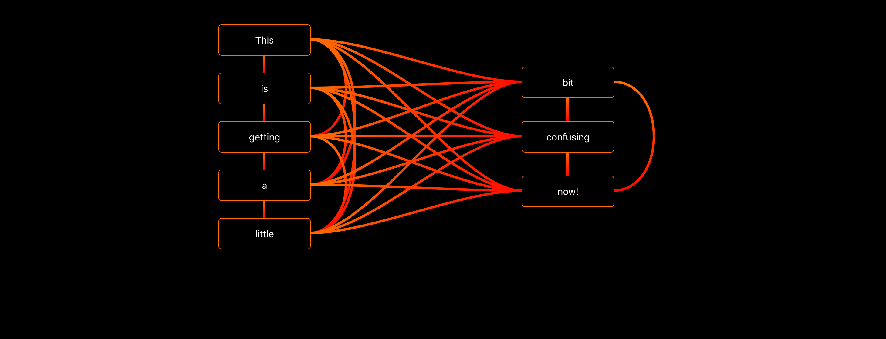
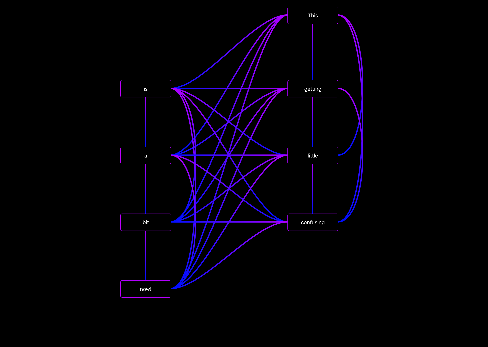

# Flowpoints
A developer-friendly library for creating flowcharts and diagrams.

Simple demo [here](https://mariusbrataas.github.io/flowpoints/?p=simpledemo) and cooler demo [here](https://mariusbrataas.github.io/flowpoints/?p=demo), both running the same source code [here](https://github.com/mariusbrataas/flowpoints/tree/master/demo/src)

Or check out [this](https://mariusbrataas.github.io/flowpoints/?p=j1t11ab05d3liaj) or [this](https://mariusbrataas.github.io/flowpoints/?p=j1t1qchh2nfqgoj) or [this](https://mariusbrataas.github.io/flowpoints/?p=j1t1161m2tjbuou)






## Installation

Quick and easy installation with npm. Package site [here.](https://www.npmjs.com/package/flowpoints)

```‌
npm install --save flowpoints
```

## Usage

```javascript
import React from 'react';
import { Flowpoint, Flowspace } from 'flowpoints';

...
<Flowspace>
  <Flowpoint key="point_a" outputs={["point_b"]}>
    Hello world
    ...
  </Flowpoint>
  <Flowpoint key="point_b">
    I am point b
    ...
  </Flowpoint>
</Flowspace>
...
```

To create a new diagram start by creating open-and-close tags for the "Flowspace". It’s in between these that you may add flowpoints.


### No-drag areas
To create a no-drag area simply set the className of your component/element to "nodrag".


### Variants
Can be defined for all flowpoints in the flowspace-props, or individually in each flowpoint's props.


### Themes
Used to determine the colors used for the flowpoints. Available themes:

- red
- purple
- deep-purple
- indigo
- blue
- light-blue
- green
- light-green
- lime
- yellow
- amber
- orange
- deep-orange
- brown
- grey
- blue-grey
- black
- white


### Outputs
The flowspace extracts information about all connections from the outputs of every flowpoint. Telling a flowpoint about inputs won’t have any effect.

To change the color and stroke of a single connection: Add that info to the output like shown below

There are two ways to pass info about the connections:

__As an array.__\
Simply pass an array with the keys to all the flowpoints the current one should be connected to.

__As an object.__\
Create an object using the following pattern:

```javascript
...
<Flowpoint
  key="point_a"
  outputs={{
    "point_b": {
      output: "auto",
      input: "auto",
      inputColor: "red",
      dash: 5
    },
    "point_c": {
      output: "right",
      input: "left"
    }
  }}>Hello World!</Flowpoint>
...
```
 
The "right" and "left" arguments tell the flowspace where on the involved flowpoints the connections should attach.

Possible locations: top, left, center (default), right, bottom.


### Flowpoint props
```js
<Flowpoint
  key="point_a"
  theme="indigo"
  variant="outlined"
  outputs={{
    "point_b": {
      output:"right",
      input:"left",
      outputColor:"#0c00ff",
      inputColor:"#ff0022",
      onClick: (key_a, key_b, e) => {
        console.log('Click connection ' + key_a + ' -> ' + key_b)
      }
    }
  }}
  style={{ backgroundColor:'lightblue' }}
  startPosition={{ x:250, y:100 }}
  selected={false}
  snap={{ x:10, y:10 }}
  dragX={true}
  dragY={true}
  minX=50
  minY=50
  width=100
  height=40
  onClick={ (e) => {console.log('Click!')} }
  onDrag={ (position) => {console.log('Drag', position)} }
  onHover={ (isHovering) => {console.log(isHovering ? 'Hovering' : 'Not hovering')} }
  > ... </Flowpoint>
```


### Flowspace props
```js
<Flowspace
  theme="indigo"
  variant="outlined"
  background="white"
  style={{ width:'100vw', height:'100vh' }}
  connectionSize=4
  selected="point_a"
  selectedLine={{ a:"point_a", b:"point_b" }}
  onLineClick={(key_a, key_b, e) => {
    console.log('Click connection ' + key_a + ' -> ' + key_b)
  }}
  onClick={e => {console.log('Clicked empty space')}}
  > ... </Flowspace>
```

Themes, variants and connectionSizes passed to the flowspace will be the default values used when drawing connections. A different value specified by a flowpoint's outputs will replace the default value for that connection only.

## Suggested pattern

Once a flowpoint unmounts it will forget it's last position. To help with this (and a few more things) I find that the following pattern works really well:

```javascript
import React, { Component } from 'react';
import ReactDOM from "react-dom";
import { Flowpoint, Flowspace } from 'flowpoints';


class App extends Component {

  constructor(props) {
    super(props);
    
    this.state = {
    
      selected_point: null,
      
      flowpoints: {
        "a": {
          position: { x:50, y:50 },
          outputs: {
            "b": {
              output:"right",
              input:"left",
              outputColor:"blue",
              inputColor:"white",
              width:3,
              onClick={(key_a, key_b) => { ... }}
            }
          }
        }
      }
    }
  }
  
  render() {
    return (
      <Flowspace
        theme="indigo"
        variant="outlined"
        background="black"
        style={{ height:"100vh", width:"100vw" }}
        onClick={e => {
          this.setState({ selected_point:null })
        }}
        selected={this.state.selected_point}>
        {
          Object.keys(this.state.flowpoints).map(key => {
            const point = this.state.flowpoints[key]
            return (
              <Flowpoint
                key={key}
                snap={ x:10, y:10 }
                startPosition={point.pos}
                onClick={() => {
                  var selected_point = this.state.selected_point
                  if (selected_point === key) {
                    selected_point = null
                  } else {
                    selected_point = key
                  }
                  this.setState({selected_point})
                }}
                onDrag={position => {
                  var flowpoints = this.state.flowpoints
                  flowpoints[key].position = position
                  this.setState({flowpoints})
                }}>{"Hello from " + key}</Flowpoint>
            )
          })
        }
      </Flowspace>
    )
  }
}

ReactDOM.render(<App />, document.getElementById('root'))
```

Of course, you can do with much less code than this, but this example should give a good indication on how you can structure your data for a flowchart.

Check out the [demo](https://mariusbrataas.github.io/flowpoints/?p=demo) and it's [source code](https://github.com/mariusbrataas/flowpoints/tree/master/demo/src) for more.

## Contributing

Made some improvements? Make sure to update the demo and create a new pull request!


### Things to improve

__Connections corners:__\
Add the option to make paths use straight corners.

__Connections animations:__\
Add an option to make connections appear as dashed lines moving from A to B at user-defined speed.

__Better touch:__\
Make it possible to drag flowpoints on touch screens without also dragging the entire window.


### Directory structure

Please maintain the following structure when making pull requests.

```
flowpoints
├── .gitattributes
├── .gitignore
├── LICENSE
├── package-lock.json
├── package.json
├── README.md
│
├── assets
│   ├── favicon.ico
│   └── this_is_flowpoints.png
│
├── demo
│   ├── src
│   ├── index.css
│   ├── index.html
│   └── index.js
│
└── src
    ├── Flowpoint.js
    ├── Flowspace.js
    └── index.js
```

## License
[MIT](https://github.com/mariusbrataas/flowpoints/blob/master/LICENSE)